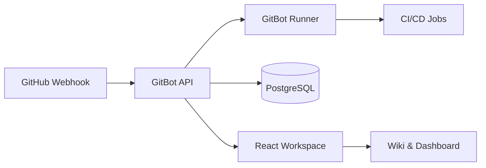

<p align="center">
  
</p>

<h1 align="center">GitBot</h1>

<p align="center">
  Nền tảng tự động hóa Pull Request, CI/CD và tài liệu vận hành dành cho đội kỹ thuật hiện đại.
</p>

<p align="center">
  <a href="#-tổng-quan">Tổng quan</a> ·
  <a href="#-tính-năng-chính">Tính năng</a> ·
  <a href="#-kiến-trúc">Kiến trúc</a> ·
  <a href="#-chạy-cục-bộ">Chạy cục bộ</a> ·
  <a href="#-triển-khai-vercel">Vercel</a>
</p>

---

## ✨ Tổng quan

**GitBot** là giao diện quản trị giúp nhóm phát triển theo dõi toàn bộ vòng đời Pull Request trong một workspace thống nhất: review diff, bình luận theo dòng, quan sát pipeline, đọc wiki nội bộ và kiểm tra readiness trước khi deploy.

Thiết kế dự án tập trung vào ba nguyên tắc:

- **Tối giản:** thông tin quan trọng được ưu tiên, ít nhiễu thị giác.
- **Hiện đại:** dark UI cho app vận hành, wiki sáng sạch theo phong cách documentation hub.
- **Thực dụng:** mọi màn hình đều phục vụ trực tiếp cho review, CI/CD, bảo mật và rollout.

## 🚀 Tính năng chính

| Khu vực | Mô tả |
| --- | --- |
| Wiki | Trang giới thiệu tài liệu, mục lục, hướng dẫn CI/CD và checklist release. |
| Dashboard | KPI repository, PR, pipeline, diff stats và tín hiệu hệ thống. |
| Code Review | Xem diff, chọn file, gửi bình luận theo ngữ cảnh PR. |
| Pipeline | Theo dõi stage lint/test/build/deploy và trạng thái workflow. |
| Mobile Simulator | Kiểm tra trải nghiệm GitBot trên khung di động mô phỏng. |
| Command Palette | Điều hướng nhanh bằng `⌘K` / `Ctrl K`. |

## 🧭 Kiến trúc



## 🧩 Logo

Logo GitBot sử dụng biểu tượng robot kết hợp nhánh Git để thể hiện vai trò trợ lý tự động hóa kỹ thuật. Bảng màu xanh `sky` và `emerald` đồng bộ với giao diện sản phẩm, gợi cảm giác đáng tin cậy, realtime và thân thiện với developer.

- File logo: [`public/gitbot-logo.svg`](public/gitbot-logo.svg)
- Có thể dùng trực tiếp cho GitHub README, header web app, favicon hoặc tài liệu nội bộ.

## 🛠 Chạy cục bộ

```bash
npm install
npm run dev
```

Ứng dụng mặc định chạy tại:

```txt
http://localhost:3000
```

## 📦 Build production

```bash
npm run build
npm run start
```

## ▲ Triển khai Vercel

Dự án đã chuẩn bị UI và build Vite phù hợp cho triển khai production. Khi môi trường có quyền registry và token Vercel, có thể deploy bằng:

```bash
npx vercel --prod --yes
```

## 📚 Tài liệu trong app

Mở ứng dụng và chọn tab **Wiki** để xem trang giới thiệu tài liệu được thiết kế riêng cho GitBot, bao gồm:

1. Tổng quan dự án.
2. Bắt đầu nhanh.
3. Cấu hình `.gitbot-ci.yml` mẫu.
4. Quy ước review và release.
5. Checklist triển khai Vercel.

## 📄 License

Apache-2.0
